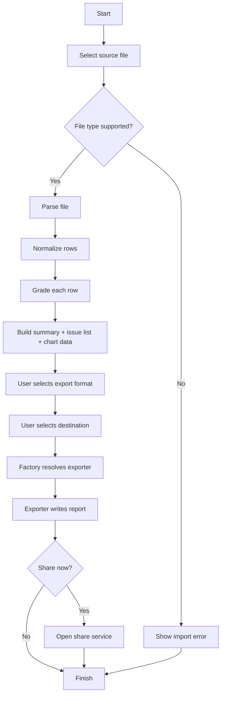

# Activity Diagram

```mermaid
flowchart TD
    A[Start] --> B[Select source file]
    B --> C{File type supported?}
    C -- No --> D[Show import error]
    C -- Yes --> E[Parse file]
    E --> F[Normalize rows]
    F --> G[Grade each row]
    G --> H[Build summary + issue list + chart data]
    H --> I[User selects export format]
    I --> J[User selects destination]
    J --> K[Factory resolves exporter]
    K --> L[Exporter writes report]
    L --> M{Share now?}
    M -- Yes --> N[Open share service]
    M -- No --> O[Finish]
    N --> O
    D --> O
```
