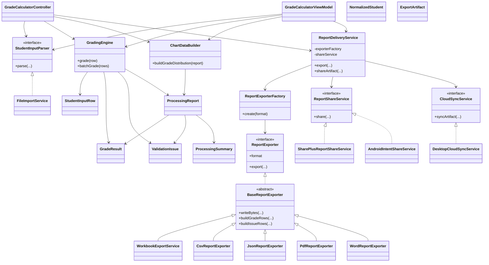

# Class Diagram

```mermaid
classDiagram
    class StudentInputParser {
        <<interface>>
        +parse(...)
    }

    class ReportExporter {
        <<interface>>
        +format
        +export(...)
    }

    class ReportShareService {
        <<interface>>
        +share(...)
    }

    class CloudSyncService {
        <<interface>>
        +syncArtifact(...)
    }

    class GradingEngine {
        +grade(row)
        +batchGrade(rows)
    }

    class ChartDataBuilder {
        +buildGradeDistribution(report)
    }

    class ReportDeliveryService {
        -exporterFactory
        -shareService
        +export(...)
        +shareArtifact(...)
    }

    class ReportExporterFactory {
        +create(format)
    }

    class BaseReportExporter {
        <<abstract>>
        +writeBytes(...)
        +buildGradeRows(...)
        +buildIssueRows(...)
    }

    class WorkbookExportService
    class CsvReportExporter
    class JsonReportExporter
    class PdfReportExporter
    class WordReportExporter

    class GradeCalculatorController
    class GradeCalculatorViewModel

    class StudentInputRow
    class NormalizedStudent
    class GradeResult
    class ValidationIssue
    class ProcessingSummary
    class ProcessingReport
    class ExportArtifact

    StudentInputParser <|.. FileImportService
    ReportExporter <|.. BaseReportExporter
    BaseReportExporter <|-- WorkbookExportService
    BaseReportExporter <|-- CsvReportExporter
    BaseReportExporter <|-- JsonReportExporter
    BaseReportExporter <|-- PdfReportExporter
    BaseReportExporter <|-- WordReportExporter
    ReportShareService <|.. SharePlusReportShareService
    ReportShareService <|.. AndroidIntentShareService
    CloudSyncService <|.. DesktopCloudSyncService

    ReportDeliveryService --> ReportExporterFactory
    ReportDeliveryService --> ReportShareService
    ReportDeliveryService --> CloudSyncService
    ReportExporterFactory --> ReportExporter

    GradingEngine --> StudentInputRow
    GradingEngine --> GradeResult
    GradingEngine --> ValidationIssue
    GradingEngine --> ProcessingReport
    ChartDataBuilder --> ProcessingReport

    GradeCalculatorController --> StudentInputParser
    GradeCalculatorController --> GradingEngine
    GradeCalculatorController --> ChartDataBuilder
    GradeCalculatorController --> ReportDeliveryService

    GradeCalculatorViewModel --> StudentInputParser
    GradeCalculatorViewModel --> GradingEngine
    GradeCalculatorViewModel --> ChartDataBuilder
    GradeCalculatorViewModel --> ReportDeliveryService

    ProcessingReport --> GradeResult
    ProcessingReport --> ValidationIssue
    ProcessingReport --> ProcessingSummary
```
