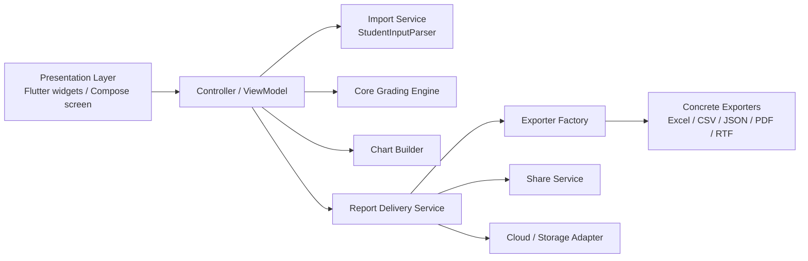

# Component Diagram

```mermaid
flowchart LR
    UI[Presentation Layer\nFlutter widgets / Compose screen]
    VM[Controller / ViewModel]
    IMPORT[Import Service\nStudentInputParser]
    GRADE[Core Grading Engine]
    CHART[Chart Builder]
    DELIVERY[Report Delivery Service]
    FACTORY[Exporter Factory]
    EXPORTERS[Concrete Exporters\nExcel / CSV / JSON / PDF / RTF]
    SHARE[Share Service]
    CLOUD[Cloud / Storage Adapter]

    UI --> VM
    VM --> IMPORT
    VM --> GRADE
    VM --> CHART
    VM --> DELIVERY
    DELIVERY --> FACTORY
    FACTORY --> EXPORTERS
    DELIVERY --> SHARE
    DELIVERY --> CLOUD
```
