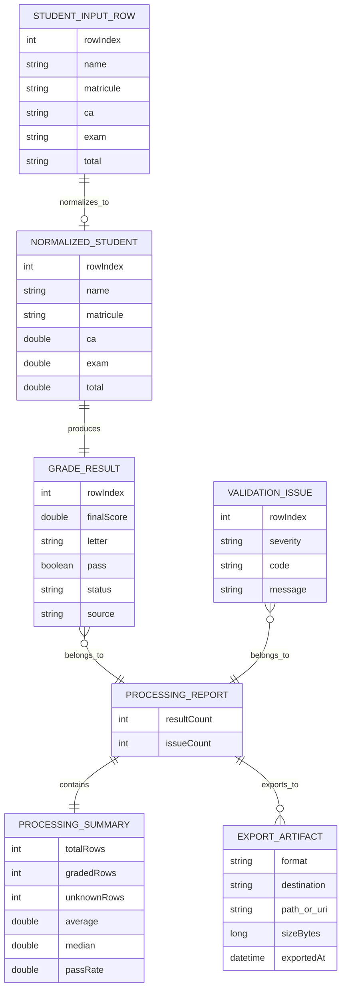

# ER Diagram

```mermaid
erDiagram
    STUDENT_INPUT_ROW ||--o| NORMALIZED_STUDENT : normalizes_to
    NORMALIZED_STUDENT ||--|| GRADE_RESULT : produces
    GRADE_RESULT }o--|| PROCESSING_REPORT : belongs_to
    VALIDATION_ISSUE }o--|| PROCESSING_REPORT : belongs_to
    PROCESSING_REPORT ||--|| PROCESSING_SUMMARY : contains
    PROCESSING_REPORT ||--o{ EXPORT_ARTIFACT : exports_to

    STUDENT_INPUT_ROW {
        int rowIndex
        string name
        string matricule
        string ca
        string exam
        string total
    }

    NORMALIZED_STUDENT {
        int rowIndex
        string name
        string matricule
        double ca
        double exam
        double total
    }

    GRADE_RESULT {
        int rowIndex
        double finalScore
        string letter
        boolean pass
        string status
        string source
    }

    VALIDATION_ISSUE {
        int rowIndex
        string severity
        string code
        string message
    }

    PROCESSING_SUMMARY {
        int totalRows
        int gradedRows
        int unknownRows
        double average
        double median
        double passRate
    }

    PROCESSING_REPORT {
        int resultCount
        int issueCount
    }

    EXPORT_ARTIFACT {
        string format
        string destination
        string path_or_uri
        long sizeBytes
        datetime exportedAt
    }
```
