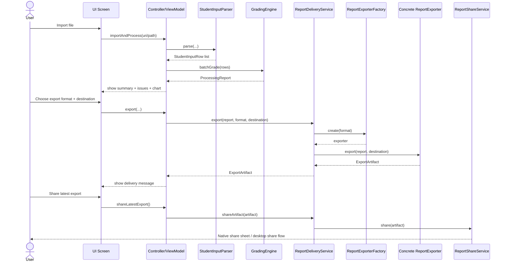

# Sequence Diagram

```mermaid
sequenceDiagram
    actor User
    participant UI as UI Screen
    participant VM as Controller/ViewModel
    participant Parser as StudentInputParser
    participant Engine as GradingEngine
    participant Delivery as ReportDeliveryService
    participant Factory as ReportExporterFactory
    participant Exporter as Concrete ReportExporter
    participant Share as ReportShareService

    User->>UI: Import file
    UI->>VM: importAndProcess(uri/path)
    VM->>Parser: parse(...)
    Parser-->>VM: StudentInputRow list
    VM->>Engine: batchGrade(rows)
    Engine-->>VM: ProcessingReport
    VM-->>UI: show summary + issues + chart

    User->>UI: Choose export format + destination
    UI->>VM: export(...)
    VM->>Delivery: export(report, format, destination)
    Delivery->>Factory: create(format)
    Factory-->>Delivery: exporter
    Delivery->>Exporter: export(report, destination)
    Exporter-->>Delivery: ExportArtifact
    Delivery-->>VM: ExportArtifact
    VM-->>UI: show delivery message

    User->>UI: Share latest export
    UI->>VM: shareLatestExport()
    VM->>Delivery: shareArtifact(artifact)
    Delivery->>Share: share(artifact)
    Share-->>User: Native share sheet / desktop share flow
```
