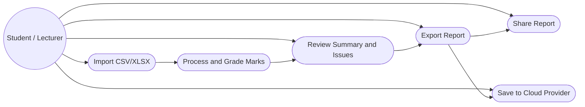

# Use Case Diagram

```mermaid
flowchart LR
    User((Student / Lecturer))
    Import([Import CSV/XLSX])
    Grade([Process and Grade Marks])
    Review([Review Summary and Issues])
    Export([Export Report])
    Share([Share Report])
    Cloud([Save to Cloud Provider])

    User --> Import
    User --> Review
    User --> Export
    User --> Share
    User --> Cloud

    Import --> Grade
    Grade --> Review
    Review --> Export
    Export --> Share
    Export --> Cloud
```
